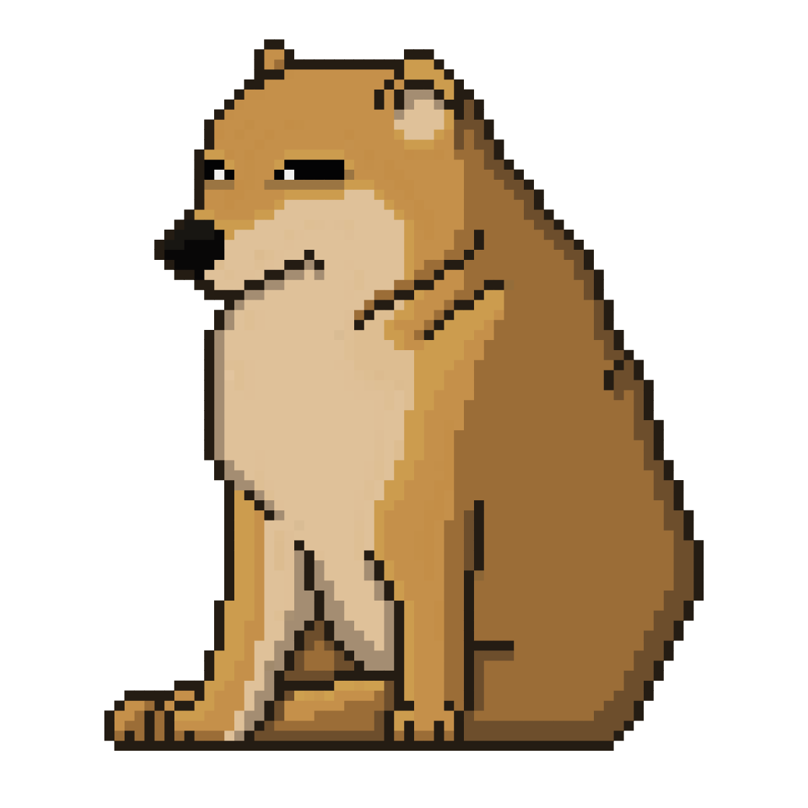

<!-- README Template by https://github.com/othneildrew -->
<!-- Link to template: https://github.com/othneildrew/Best-README-Template.git -->

[![LinkedIn][linkedin-shield]][linkedin-url] [![GitHub][GitHub]][github-url] [![Email][Gmail]][Email-url]

<!-- PROJECT LOGO -->
 

    
     
    
Image from <a href="https://pngtree.com/freepng/big-cheems-in-8bit-pixel_6408782.html"><strong>pngtree.com</strong></a>

<h3 align="center">Personal Portfolio</h3>
  

    A simple portfolio made with NextJS and TailwindCSS.
     
    <a href="https://jnllaee.vercel.app/"><strong>View the website »</strong></a>
     
  

<!-- ABOUT THE PROJECT -->

## About

[![Portfolio Screenshot][product-screenshot]](https://jnllaee.vercel.app/)

A _very_ simple and responsive portfolio, made by yours truly. The portfolio consists of everything you need to know about me and what I do. Also features **light** and **dark** mode. Now available here: **https://jnllaee.vercel.app/**.

### Built With

-   [![Next][Next.js]][Next-url]
-   [![Tailwind][TailwindCSS]][Tailwind-url]

(<a href="#readme-top">back to top</a>)

<!-- CONTACT -->

## Contact

Feel free to reach out to me through the following channels:

-   **LinkedIn**: [jnllaeemangalao](https://www.linkedin.com/in/jnllaeemangalao/)
-   **GitHub**: [@jnllaee](https://github.com/jnllaee)
-   **Email**: [jmaxinem25@gmail.com](mailto:jmaxinem25@gmail.com)

(<a href="#readme-top">back to top</a>)

<!-- ACKNOWLEDGMENTS -->

## Acknowledgments

-   [Shields.io](https://shields.io/)
-   [Best README Template by othneildrew](https://github.com/othneildrew/Best-README-Template.git)
-   [Badges4 README.md Profile by alexandresanlim](https://github.com/alexandresanlim/Badges4-README.md-Profile.git)
-   [react-icons](https://react-icons.github.io/react-icons/)
-   [Big Cheems in 8bit Pixel](https://pngtree.com/freepng/big-cheems-in-8bit-pixel_6408782.html)

(<a href="#readme-top">back to top</a>)

<!-- MARKDOWN LINKS & IMAGES -->
<!-- https://www.markdownguide.org/basic-syntax/#reference-style-links -->

[linkedin-shield]: https://img.shields.io/badge/LinkedIn-0077B5?style=for-the-badge&logo=linkedin&logoColor=white
[linkedin-url]: https://www.linkedin.com/in/jnllaeemangalao/
[product-screenshot]: public/proj_portfolio.png
[Next.js]: https://img.shields.io/badge/next%20js-000000?style=for-the-badge&logo=nextdotjs&logoColor=white
[Next-url]: https://nextjs.org/
[TailwindCSS]: https://img.shields.io/badge/Tailwind_CSS-38B2AC?style=for-the-badge&logo=tailwind-css&logoColor=white
[Tailwind-url]: https://tailwindcss.com/
[GitHub]: https://img.shields.io/badge/GitHub-100000?style=for-the-badge&logo=github&logoColor=white
[GitHub-url]: https://github.com/jnllaee
[Gmail]: https://img.shields.io/badge/Email-D14836?style=for-the-badge&logo=gmail&logoColor=white
[Email-url]: mailto:jmaxinem25@gmail.com
